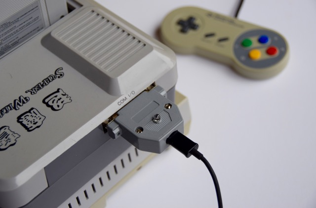

SWC USB Adapter
===============

SWC USB Adapter is a peripheral for the Super Wild Card backup unit that makes it USB compatible.

Features
--------
* Connect a Super Wild Card via USB to a modern computer that does not have a parallel port.
* Compatible with most operating systems. The program is writen in Python and the adapter uses the USB CDC driver that is built into most modern operating systems.
* Transfer speed on par with parallel port transfer.
* No need for a thick parallel port cable.
* More convenient than floppies or a USB floppy emulator.
* The hardware parts are widely available and not too hard to assemble.
* Program auto detects the adapter, no need to specify the port.
* It is a open hardware and software project.

Usage example
-------------

To transfer a ROM file to the Super Wild Card:

`swc_usb.py send-rom --hirom <file>`

To fetch a SRAM dump:

`swc_usb.py fetch-sram <file>`

Questions and answers
----------------------
Q: Why not just use any USB to parallel adapter?

A: It won't work, almost all of them are for printers only, and if you find one that truly emulates a parallel port the latency of USB will make the transfers really slow.

Q: Do I need to surface mount solder and have a PCB manufactured?

A: You should be able to use any Atmega32u4 breakout board and solder wires from it to a male D-Sub 25 connector. That project hardware is basically the same thing but in a nicer form factor.

Q: How do I compile the firmware?

A: swc_usb.hex is a compiled firmware ready to be loaded onto the controller. If you want to compile it yourself, set up a AVR tool chain and run `make all` in the firmware directory.

Q: Does it have all the swc transfer features that Ucon64 has?

A: No, It can send ROM files, send SRAM, fetch SRAM. If there is interest in some other feature I might add it.

Q: Which variants of the Super Wild Card is supported?

A: I think it works on all but I have tested it on: Super Magicom (MS-3201), Super Wild Card (SMS3201), Super Wild Card DX (SWC3201)

Atmega32u4 pin mapping to the D-Sub
-----------------------------------

| Atmega32u4 | D-Sub |
|------------|-------|
| PB3        | 15    |
| PB4        | 13    |
| PB5        | 12    |
| PB6        | 10    |
| PB7        | 11    |
| PD0        | 2     |
| PD1        | 3     |
| PD2        | 4     |
| PD3        | 5     |
| PD4        | 6     |
| PD5        | 7     |
| PD6        | 8     |
| PD7        | 9     |
| PF4        | 1     |
| PF5        | 14    |
| PF6        | 16    |
| PF7        | 17    |
| GND        | 25    |
	 

Thanks
------
This project would probably not have been made without the awesome [LUFA](http://www.fourwalledcubicle.com/LUFA.php) library. [Ucon64](http://ucon64.sourceforge.net/) have been a great source of information on how to communicate with the SWC and a starting point for code.
